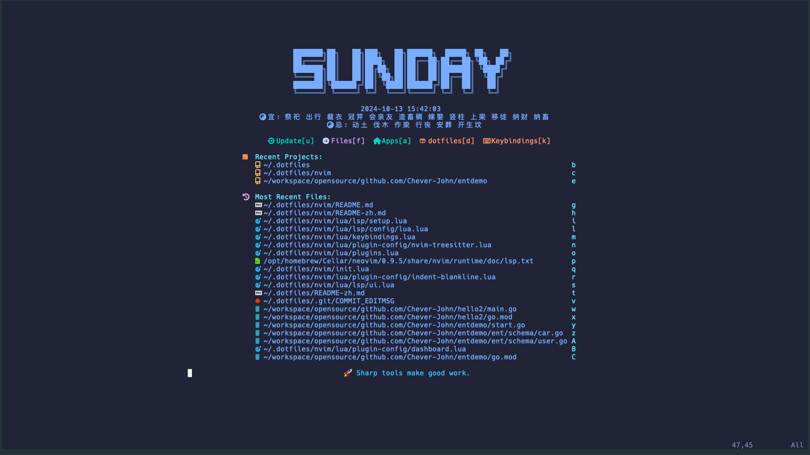

# 这里记录我的 nvim 美化方案

先从 dashboard 开始。

## dashboard

我这边先将一个 dashboard 的吧

### 宜忌



这是我现在的 dashboard，这里可以看到我有中国人传统的 宜忌，这个就图着乐。

这个主要的方案是根据一个博客完成的，博客[地址](https://blog.hoholi.com/blog/%E7%BB%99neovim%E5%90%AF%E5%8A%A8%E9%A1%B5%E5%8A%A0%E7%82%B9%E6%9C%89%E8%B6%A3%E7%9A%84%E5%AE%9C%E5%BF%8C%E6%96%87%E6%A1%88/)。

主要就是下面的脚本：

```shell
~: cd .dotfiles/nvim/
nvimgit:(docs/add-sth-about-lunarjs*): tree scripts
scripts
└── yiji.js

0 directories, 1 file
```

上面的 scripts 这个目录下，下载一下 lunar.js，命令如下：

```shell
scriptsgit:(docs/add-sth-about-lunarjs*): wget https://cdnjs.cloudflare.com/ajax/libs/lunar-javascript/1.6.12/lunar.js
--2024-10-13 15:54:10--  https://cdnjs.cloudflare.com/ajax/libs/lunar-javascript/1.6.12/lunar.js
Resolving cdnjs.cloudflare.com (cdnjs.cloudflare.com)... 104.17.25.14
Connecting to cdnjs.cloudflare.com (cdnjs.cloudflare.com)|104.17.25.14|:443... connected.
HTTP request sent, awaiting response... 200 OK
Length: unspecified [application/javascript]
Saving to: ‘lunar.js’

lunar.js                     [   <=>                             ] 424.84K   729KB/s    in 0.6s

2024-10-13 15:54:12 (729 KB/s) - ‘lunar.js’ saved [435035]

scriptsgit:(docs/add-sth-about-lunarjs*): ls
lunar.js yiji.js
scriptsgit:(docs/add-sth-about-lunarjs*): tree .
.
├── lunar.js
└── yiji.js

0 directories, 2 files
```

拆一下命令：

```shell
cd ~/.dotfiles/nvim/scripts
wget https://cdnjs.cloudflare.com/ajax/libs/lunar-javascript/1.6.12/lunar.js
```

进入到这个目录，然后，wget 一下就行了。

然后看一下 yiji.js，如下：

```js
const { Lunar } = require("./lunar");
const d = Lunar.fromDate(new Date());

const yi = d.getDayYi().join(" ");
const ji = d.getDayJi().join(" ");

function getTodayYiJi() {
  return {
    yi,
    ji,
  };
}

module.exports = {
  getTodayYiJi,
};
```

然后我需要在 dashboard 上，`nvim/lua/plugin-config/dashboard.lua` 如下：

```lua
local status, db = pcall(require, 'dashboard')
if not status then
    vim.notify('没有找到 dashboard')
    return
end

-- 获取宜忌信息
local function getYiJi()
  local cmd = "node -e \"console.log(require('${HOME}/.config/nvim/scripts/yiji.js').getTodayYiJi())\""
  local handle = io.popen(cmd)
  local result = handle:read("*a")
  handle:close()

  local yi = result:match("yi: '(.*)',")
  local ji = result:match("ji: '(.-)'")

  return ' 宜: ' .. (yi or ""), ' 忌: ' .. (ji or "")
end

local yi_with_Chinese, ji_with_Chinese = getYiJi()

db.setup({
  theme = 'hyper',
  config = {
    packages = {enable = false},
    mru = { limit = 20, cwd_only = false },
      week_header = {
          enable = true,
          append = {
              yi_with_Chinese,
              ji_with_Chinese,
          }
      },
..........................................................................................
```

然后你就可以得到我的同款了。