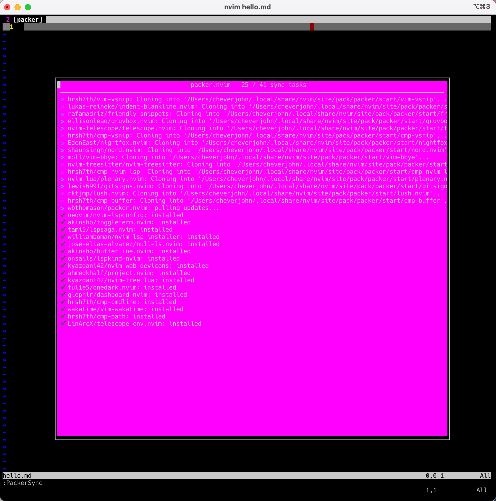

# NeoVim

我更新了最全套的

## Neovim（Lua 版本）

花了一点钱，在掘金小册上买了一套[书](https://juejin.cn/book/7051157342770954277?scrollMenuIndex=0)，然后根据其搭建了一套基本的 Neovim 的框架知识。目前我的 Neovim（lua 版本）如 `tree` 命令所示：

```bash
➜  nvim git:(master*)tree
.
├── README-zh.md
├── README.md
├── init.lua
├── init.vim.bp
├── lua
│   ├── basic.lua
│   ├── colorscheme.lua
│   ├── keybindings.lua
│   ├── lsp
│   │   ├── cmp.lua
│   │   ├── config
│   │   │   ├── go.lua
│   │   │   └── lua.lua
│   │   ├── formatter.lua
│   │   ├── null-ls.lua
│   │   ├── setup.lua
│   │   └── ui.lua
│   ├── plugin-config
│   │   ├── bufferline.lua
│   │   ├── dashboard.lua
│   │   ├── indent-blankline.lua
│   │   ├── lualine.lua
│   │   ├── nvim-tree.lua
│   │   ├── nvim-treesitter.lua
│   │   ├── project.lua
│   │   └── telescope.lua
│   └── plugins.lua
└── plugin
    └── packer_compiled.lua
```

本文将讲解 `nvim` 基本框架、如何快速在一台新的机器上搭建 `nvim` 开发环境两个话题开展。

### nvim 框架的讲解

搭建 nvim 个人环境的方式有很多，大致可以分为三个阶段：选好合适的包管理工具、调教好适合自己的定制化配置、选择合适的插件。其中某些插件会跟默认的配置有一些冲突，我们也要选择性地进行调校。

### ⭐️如何快速搭建起自己的 nvim 开发环境

这是很重要的环节，首先将项目从 GitHub [地址](https://github.com/chever-john/dotfiles) pull 到本地，这一点是毋庸置疑的。这是第一阶段最简单的操作。本小结将围绕一下几个阶段完成：

1. 安装 Nerd font 字体
2. 将项目拉到本地，并设置好一些必要的操作；
3. 将 nvim 需要的一些插件或者软件下载；

#### 第一步：安装 Nerd font 字体

##### 背景介绍

事实上在之前使用了那么久的 nvim，我居然一直都没有安装 Nerd Font 字体，这属实是一件很离谱的事情。因为官方也没有告诉我必须要安装 Nerd Font 字体。

事实上，因为命令行中是不支持显示图标的，我们只有通过安装 Nerd font，才能够解决问题。Nerd Fonts 是一个使用了大量字体图标来解决程序员在开发过程中缺少合适字体的问题的项目。它可以从流行的字体图标库中将大量外部字体引入待开发的项目中，它支持的字体图标库包括 Font Awesome , Devicons , Octicons , and others。

简单来说，Nerd Fonts 就是常见的各种 iconic fonts，打包到你常用的字体里，这样在命令行汇总就可以显示这些图标了。

因为 Neovim 很多插件都会使用到这里的图表，所以我们必须要正确安装才可以在命令行中正确显示 icons。

##### 安装 Nerd fonts

Nerd fonts 本身并不是一种新的字体，而是把常用图标以打补丁的方式打到了常用字体上。

比如我在 VSCode 里最常用的是 `Fira Code` 字体，那么我就要去安装这个打了 Nerd fonts 补丁的 `FiraCode` 字体。或者你也可以到官网这里 [www.nerdfonts.com/font-downlo…](https://link.juejin.cn/?target=https%3A%2F%2Fwww.nerdfonts.com%2Ffont-downloads) 找到你喜欢的字体。

这里我找到的字体的路径为：

```bash
https://github.com/ryanoasis/nerd-fonts/tree/master/patched-fonts/FiraCode/Regular/complete/
```

此处注意⚠️要下载兼容 Windows 的版本，即名为 `Windows Compatible.ttf`，下载后点击安装即可完成。

然后回到 Terminal（macOS 就是我常用的 Iterm2啦）中点击设置，外观，选择我们下载的字体即可。安装完成之后，可以测试一下，点击一下[网址](https://link.juejin.cn/?target=https%3A%2F%2Fwww.nerdfonts.com%2Fcheat-sheet)，然后复制 icon，然后粘贴到命令行中，看一下是否正常即可。

#### 第二步：将项目 pull 到本地

首先确保本地已经安装了 neovim，安装的方式参见[官方文档](https://github.com/neovim/neovim/wiki/Installing-Neovim)。

总而言之，不管你是什么系统，macOS 还是 ubuntu，最后一切的最开始一定是要有 neovim 的。

```bash
➜  ~ nvim --version
NVIM v0.7.0
Build type: Release
LuaJIT 2.1.0-beta3
Compiled by brew@HMBRW-A-001-M1-004.local
```

##### 拉取项目

确保本地安装好 git，然后我们最好位于当前用户的根目录下，执行命令如下：

```bash
git clone git@github.com:Chever-John/dotfiles.git
```

这个时候我们大概率会得到一个 `/Users/cheverjohn/dotfiles` 文件，我个人一般会将其文件夹再命名为 `/Users/cheverjohn/.dotfiles`，这样可以隐藏起来。

所以此时我们的个人配置文件 `nvim` 的目录地址为 `/Users/cheverjohn/.dotfiles/nvim`。

##### 配置软链接

因为 nvim 默认的配置文件入口在 `~/.config/nvim/init.lua`，当然也可以是 `~/.config/nvim/init.vim`。

所以此处选择直接使用软链接，在 `~/.config` 中软链接一个 `nvim` 文件夹。软链接命令如下：

```bash
ln -s ~/.dotfiles/nvim ~/.config/nvim
```

#### 第三步：将一些依赖 or 插件下载

##### 安装插件管理器

我是用 Packer.nvim 插件管理器。

安装命令如下：

```bash
git clone --depth 1 https://github.com/wbthomason/packer.nvim\
 ~/.local/share/nvim/site/pack/packer/start/packer.nvim
```

#### 第四步：开始自动安装插件

这一步，我想了想还是额外加上了，因为要把用户当傻瓜（事实上是我自己过了一段时间，发现不知道该咋办了）

其实这个时候，只需要一行命令就可以实现安装了。

```sh
nvim hello.md
```



一般到现在的话，一切就都已经结束了。

### 一些额外需要做的事情

安装 `stylua` 等一些格式化工具。

此时需要注意的是，我是 Fedora 系统的时候，发现什么都不需要下载。

```bash
brew install shfmt
brew install stylua
```

如果你是 ubuntu 系统，请使用下面的命令：

```bash
sudo apt update
sudo apt install snapd
sudo snap install shfmt
```

## 一些常见插件的介绍以及用法简介

### vim-airline

GitHub:  <https://github.com/vim-airline/vim-airline>

可以作为状态栏的插件而已，暂时没有发现可以命令交互的场景。

### ctrlp

GitHub: <https://github.com/ctrlpvim/ctrlp.vim>

这个插件比较常用，我们可以用它的模糊搜索功能（fuzzing search）。

具体用法就是，在正常编辑模式下，直接 `control + p` 键即可。

然后你就可以输入你想要访问的文件。支持模糊搜索。

### vim-commentary

这是一个注释用的插件。具体操作流程如下 gif 图所示：


### vim-gitgutter

显示是否有增改，如果你增加了一行，他会提示一个加号，仅此而已。

## 如何使用好本文件夹？

### 使用软链

我们可以直接使用软链接，将原本系统里的配置文件替换成这个文件夹里的配置文件。此处需要注意的是，因为一般性，我的 neovim 的配置文件 `init.vim` 位置处于 `~/.config/nvim/init.vim`。那么我只需要运行如下的软链接设置命令即可：

```bash
ln -s /nvim/init.vim ~/.config/nvim/init.vim
```

注意该命令运行位置在本项目的根目录下，请万分注意～

### 如何更新 Neovim

我想，当我某一天使用 nvim 打开某个文件夹，这丫的，居然给我爆出这个错误，错误如下图所示：


我就知道我摊上事了，首先汇报我的系统版本：

```bash
Ubuntu version: 20.04.4 LTS (GNU/Linux 5.4.0-122-generic x86_64)
System arch: x86_64
```

然后开始我的安排：

#### 删除 Neovim

首先删除 neovim，命令如下：

```bash
sudo apt remove neovim -y
```

#### 更新 Neovim

然后开始更新，首先添加仓库，命令如下：

```bash
sudo add-apt-repository ppa:neovim-ppa/stable
```

然后开始安装，命令如下：

```bash
sudo apt-get update
sudo apt-get install neovim
```

然后就大功告成，然后可以用如下命令查看版本：

```bash
nvim --version
```

### 如何配置 nvim

#### Centos7 上的安装方法

不要尝试包括但不仅限于 `dnf`、`yum`的命令去安装 nvim，这是徒劳的。要知道对于 Centos7 这个感觉已经被世界抛弃了的版本来说，这些通用的包管理工具支持程度不高！

#### 安装方法

进入到 nvim 的版本下载[地址](https://github.com/neovim/neovim/releases/tag/v0.7.2)，这边我选择下载 `Nvim v0.7.2` 版本。命令如下：

```bash
wget https://github.com/neovim/neovim/releases/download/v0.7.2/nvim-linux64.tar.gz
```

然后运行解压缩命令，命令如下：

```bash
tar -xvf nvim-linux64.tar.gz
```

然后直接找到里边的可执行文件，并配置好环境变量即可。

就是这么简单就好了，千万别想着去用 cmake 一类的工具自己编译（当然如果你有时间的话，另说）

#### 配置文件

此处参考的是 YouTube 上

#### 配置中可能存在的问题

你会遇到需要你 `Run ":checkhealth provider"` 的问题。这个问题的本质是你没有匹配好本地的 Python 版本，经过测试，python3.8.10 可以解决这个问题。解决方法如下：

首先得到 Python3.8.10 的远吗安装包，命令如下：

```bash
wget https://www.python.org/ftp/python/3.8.10/Python-3.8.10.tgz
```

解压安装包，命令如下：

```bash
tar -xvf Python-3.8.10.tgz
```

进入到该压缩安装包，命令如下：

```bash
cd Python-3.8.10
```

然后编译 Python，命令如下：

```bash
.configure
```

安装 Python，命令如下：

```bash
sudo make && sudo make install
```

接下来需要安装pynvim 包，命令如下：

```bash
python3 -m pip install --user --upgrade pynvim
```

然后就解决问题了。

##### nvim-treesitter 最新更新遇到的问题

问题的简要来看如下

```bash
Highlights broken after update with query: invalid structure #3092

```

直接在官方的 [issues](https://github.com/nvim-treesitter/nvim-treesitter/issues/3092) 中找到解决办法。

## 插件配置

这部分主要讲一下我后期维护的插件配置。

[leetcode.nvim](docs/plugins/leetcode-nvim-zh.md)：用于 leetcode 刷题的一个插件。
