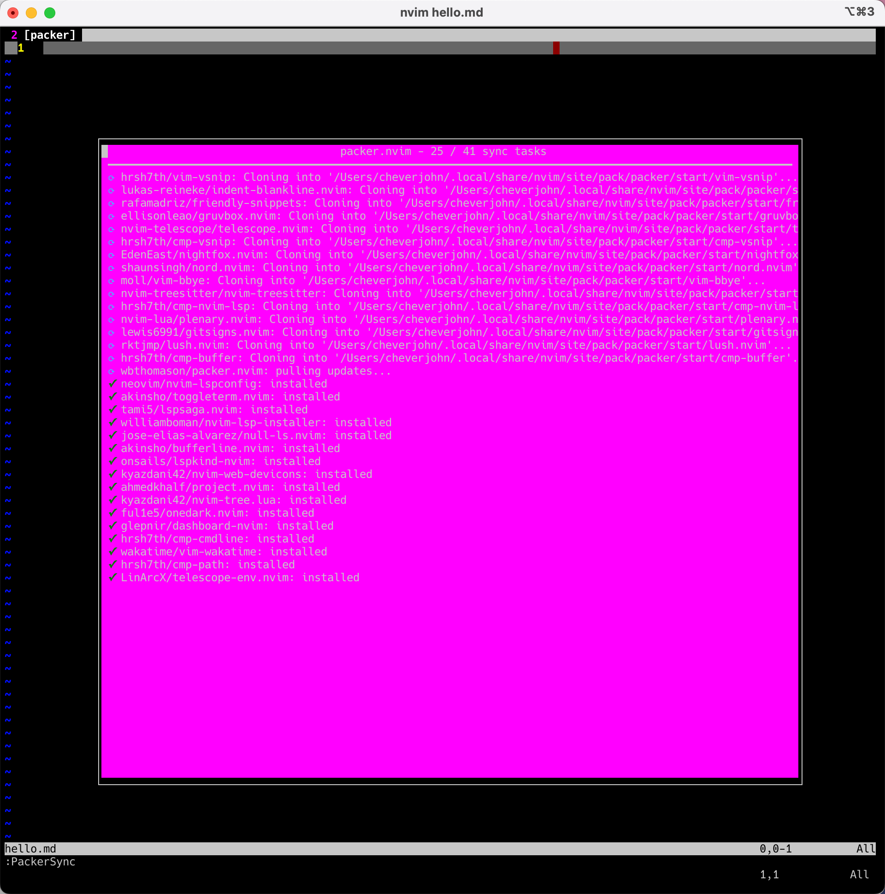

# NeoVim

[中文](./README-zh.md)

I have updated the most comprehensive set

## Neovim (Lua Version)

I spent a bit of money and purchased a set of [books](https://juejin.cn/book/7051157342770954277?scrollMenuIndex=0) on Juejin, and then built a basic framework knowledge of Neovim based on it. Currently, my Neovim (Lua version) looks as shown by the `tree` command:

```bash
➜  nvim git:(master*)tree
.
├── README-zh.md
├── README.md
├── init.lua
├── init.vim.bp
├── lua
│   ├── basic.lua
│   ├── colorscheme.lua
│   ├── keybindings.lua
│   ├── lsp
│   │   ├── cmp.lua
│   │   ├── config
│   │   │   ├── go.lua
│   │   │   └── lua.lua
│   │   ├── formatter.lua
│   │   ├── null-ls.lua
│   │   ├── setup.lua
│   │   └── ui.lua
│   ├── plugin-config
│   │   ├── bufferline.lua
│   │   ├── dashboard.lua
│   │   ├── indent-blankline.lua
│   │   ├── lualine.lua
│   │   ├── nvim-tree.lua
│   │   ├── nvim-treesitter.lua
│   │   ├── project.lua
│   │   └── telescope.lua
│   └── plugins.lua
└── plugin
    └── packer_compiled.lua
```
This article will explain the basic framework of nvim and how to quickly build a nvim development environment on a new machine.

### Explanation of the nvim framework

There are many ways to set up a personal nvim environment. Generally, it can be divided into three stages: choosing the right package management tool, tuning customized configurations that suit oneself, and selecting appropriate plugins. Some plugins may conflict with default configurations, and we need to adjust them selectively.

### ⭐️How to quickly set up your own nvim development environment

This is a crucial step. First, pull the project from the GitHub address to your local machine, which is undoubtedly the simplest operation in the first stage. This section will cover the following stages:

1. Install Nerd font
2. Pull the project to your local machine and set up some necessary configurations;
3. Download some necessary plugins or software for nvim;

#### Step 1: Install Nerd font

##### Background Introduction

In fact, even after using nvim for so long before, I never installed Nerd Font, which is indeed ridiculous. Because the official documentation never mentioned that I must install Nerd Font.

In reality, the command line does not support displaying icons. We can only resolve the issue by installing Nerd font. Nerd Fonts is a project that uses many font icons to solve the problem of a lack of proper fonts for developers during development. It integrates many external fonts into the project being developed from popular icon font libraries such as Font Awesome, Devicons, Octicons, and others.

Simply put, Nerd Fonts packages various common iconic fonts into the fonts you frequently use so that you can display these icons in the command line summary.

Since many Neovim plugins will use these icons, we must install them correctly to display the icons correctly in the command line.

##### Installing Nerd fonts

Nerd fonts are not new fonts but adds patches of common icons into the regular fonts.

For example, my most frequently used font in VSCode is Fira Code, so I need to install the FiraCode font patched with Nerd fonts. Or you can go to the official website www.nerdfonts.com/font-downloads to find the font you like.

I found the path to the font here:

```shell
https://github.com/ryanoasis/nerd-fonts/tree/master/patched-fonts/FiraCode/Regular/complete/
```

Please note⚠️ to download the version compatible with Windows, which is named Windows Compatible.ttf. Download and install it directly by clicking.

Then go back to Terminal (macOS, which is the iTerm2 I frequently use) and click settings, appearance, and select the font we downloaded. After installation, you can test it. Click on this [link](https://link.juejin.cn/?target=https%3A%2F%2Fwww.nerdfonts.com%2Fcheat-sheet), copy an icon, and paste it into the command line to see if it displays correctly.

#### Step 2: Pull the project to the local machine

Ensure neovim is already installed locally. Refer to the official [documentation](https://github.com/neovim/neovim/wiki/Installing-Neovim) for installation methods.

In summary, no matter what system you are using, macOS or ubuntu, you must have neovim to begin with.

```bash
╰─[:(] % nvim --version
NVIM v0.9.5
Build type: Release
LuaJIT 2.1.1710088188

   system vimrc file: "$VIM/sysinit.vim"
  fall-back for $VIM: "/opt/homebrew/Cellar/neovim/0.9.5/share/nvim"

Run :checkhealth for more info
```

##### Pull Project

```bash
git clone git@github.com:Chever-John/dotfiles.git
```

At this point, we will probably end up with a `/Users/cheverjohn/dotfiles` file. I usually rename this folder to `/Users/cheverjohn/.dotfiles` to hide it.

So at this point, the directory address of our personal configuration file nvim is `/Users/cheverjohn/.dotfiles/nvim`.

##### Configure symbolic links

Since the default configuration file entrance of nvim is `~/.config/nvim/init.lua`, it could also be `~/.config/nvim/init.vim`.

So here we choose to use symbolic links directly and link a nvim folder in `~/.config`. The command for creating a symbolic link is as follows:

```bash
ln -s ~/.dotfiles/nvim ~/.config/nvim
```

#### Step 3: Download some dependencies or plugins

Install the plugin manager
I use the Packer.nvim plugin manager.

The installation command is as follows:

```bash
git clone --depth 1 https://github.com/wbthomason/packer.nvim\
 ~/.local/share/nvim/site/pack/packer/start/packer.nvim
```

#### Step 4: Start to automatically install plugins

In this step, I still decided to add it because treating users as fools (in fact, after a period of time, I personally don't know what to do).

At this time, just one command can achieve the installation.

```sh
nvim hello.md
```



Usually, by now, everything is over.

#### Some additional tasks to do

Install formatting tools such as `stylua`.

In my case with the Fedora system, I found that nothing needed to be downloaded.

If in the case with the MacOS system. You must run the following commands:

```bash
brew install shfmt
brew install stylua
```

If you are on an ubuntu system, please use the following commands:

```bash
sudo apt update
sudo apt install snapd
sudo snap install shfmt
```

### Introduction and usage of some common plugins

#### vim-airline

GitHub: https://github.com/vim-airline/vim-airline

It can be used as a status bar plugin and currently has no command interaction scenarios found.

#### ctrlp

GitHub: https://github.com/ctrlpvim/ctrlp.vim

This plugin is relatively common, and we can use it for fuzzing search.

You just need to directly press the control + p keys in normal editing mode.

Then you can input the file you want to visit. It supports fuzzing search.

#### vim-commentary

This is a plugin for commenting. The specific operating process is shown in the gif below.(Sry, the link is expired. Wait for repairing it!)

#### vim-gitgutter

It displays whether there are additions or modifications. If you add a line, it will indicate a plus sign and nothing more.

### How to use this folder properly?

Content as following:

1. Use symbolic lins.

#### Use symbolic links

We can directly use symbolic links to replace the system configuration files with the ones in this folder. Note that generally, my Neovim configuration file init.vim is located at ~/.config/nvim/init.vim. So I just need to run the following command to set up the symbolic link:

```bash
ln -s /nvim/init.vim ~/.config/nvim/init.vim
```

Note that this command should be run in the root directory of this project. Please be extremely cautious.

### How to update Neovim

I think if one day I open a folder with nvim and it throws this error, as shown in the image below:

Error Reporting

I knew I was in trouble. First, let me report my system version:

```bash
Ubuntu version: 20.04.4 LTS (GNU/Linux 5.4.0-122-generic x86_64)
System arch: x86_64
```

Then I start my process:

#### Remove Neovim

First, remove neovim with the following command:

```bash
sudo apt remove neovim -y
```

#### Update Neovim

Then start updating. First, add the repository with the following command:

```bash
sudo add-apt-repository ppa:neovim-ppa/stable
```

Then start installing with the following commands:

```bash
sudo apt-get update
sudo apt-get install neovim
```

Then it's all done. You can check the version with the following command:

```bash
nvim --version
```

### How to configure nvim

Content as following:

1. Installation method on Centos7;
2. Installation method;
3. Configuration files;
4. Possible issues with configuration

#### Installation method on Centos7

Do not attempt to use commands including but not limited to dnf and yum to install nvim, as it would be futile. For Centos7, which seems to have been abandoned by the world, these general package management tools are not well supported!

#### Installation method

Go to the download address of the nvim version you want. Here I choose to download Nvim v0.7.2. The command is as follows:

```bash
wget https://github.com/neovim/neovim/releases/download/v0.7.2/nvim-linux64.tar.gz
```

Then run the decompression command as follows:

```bash
tar -xvf nvim-linux64.tar.gz
```

Then find the executable file inside and configure the environment variables.

It's that simple, don't even think about using tools like cmake to compile it yourself (unless you have spare time).

#### Configuration files

Referencing YouTube here.

#### Possible issues with configuration

You may encounter issues requiring you to Run ":checkhealth provider". The essence of this problem is that you haven't matched the local Python version. After testing, python3.8.10 can solve this issue. The solution is as follows:

First, get the remote installation package of Python3.8.10 with the following command:

```bash
wget https://www.python.org/ftp/python/3.8.10/Python-3.8.10.tgz
```

Decompress the installation package with the following command:

```bash
tar -xvf Python-3.8.10.tgz
```

Switch to the directory of this decompressed package with the following command:

```bash
cd Python-3.8.10
```

Then compile Python with the following command:

```bash
.configure
```

Install Python with the following command:

```bash
sudo make && sudo make install
```

Next, install the pynvim package with the following command:

```bash
python3 -m pip install --user --upgrade pynvim
```

Then the problem is resolved.

##### Issue with nvim-treesitter update

A brief summary of the issue is as follows:

```bash
Highlights broken after update with query: invalid structure #3092
```

Directly find the solution in the official issues.

## Plugin Configuration

This part mainly discusses my later maintenance of the plugin configuration.

- leetcode.nvim: A plugin for solving Leetcode questions.
- Beautify plugin: My overall beautification idea, see the document [here](docs/plugins/beautify.md)

## Garbled problem

When I use vscode to open this project, many icons are garbled. In fact, you just need to go to https://www.nerdfonts.com/font-downloads, and download a compatible font. Currently, my commonly used font is Nerdfont, which has been tested to work.

